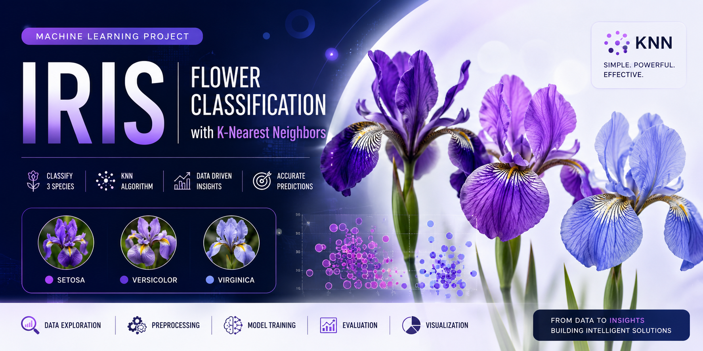
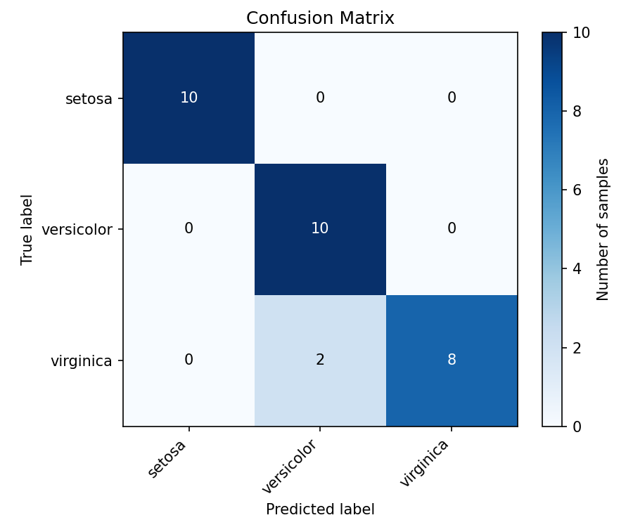
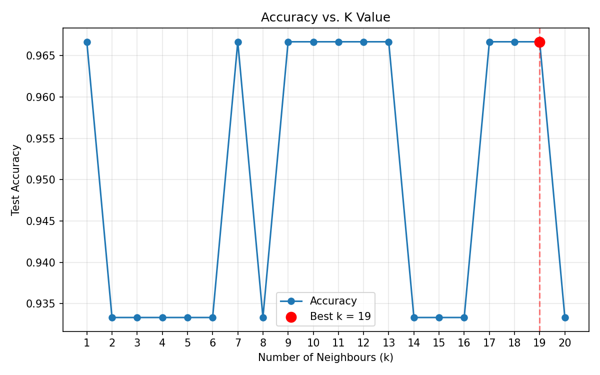

# 🌸 Iris Flower Classification with K-Nearest Neighbors (KNN)

<p align="center">
  
</p>

<p align="center">


</p>

A clean, modular, beginner-friendly **Supervised Machine Learning** project that classifies Iris flowers into three different species using the **K-Nearest Neighbors (KNN)** algorithm.

This project demonstrates an end-to-end machine learning workflow, from loading raw data to evaluating and optimizing a predictive model. It is designed as a professional GitHub portfolio project and follows software engineering best practices including modular code, documentation, reproducibility, and visualization.

---

# 📚 Table of Contents

- [Overview](#-project-overview)
- [Features](#-features)
- [Dataset Description](#-dataset-description)
- [Machine Learning Pipeline](#-machine-learning-pipeline)
- [Project Workflow](#-project-workflow)
- [Pipeline Architecture](#-pipeline-architecture)
- [Key Concepts Explained](#-key-concepts-explained)
- [Technologies Used](#-technologies-used)
- [Project Structure](#-project-structure)
- [Installation](#-installation)
- [Running the Project](#-running-the-project)
- [Example Output](#-example-output)
- [Evaluation Metrics](#-evaluation-metrics)
- [Generated Visualizations](#-generated-visualizations)
- [Skills Demonstrated](#-skills-demonstrated)
- [Future Improvements](#-future-improvements)
- [License](#-license)

---

# 🌼 Project Overview

The Iris dataset is one of the most famous datasets in Machine Learning.

Using only four measurements of a flower:

- Sepal Length
- Sepal Width
- Petal Length
- Petal Width

the model predicts whether the flower belongs to one of three species:

- 🌸 Setosa
- 🌸 Versicolor
- 🌸 Virginica

Although the dataset is simple, it demonstrates every major stage of a supervised machine learning pipeline that is used in real-world AI projects.

Rather than focusing only on achieving high accuracy, this project emphasizes clean architecture, readability, modular programming, explainability, and reproducibility.

---

# ✨ Features

✔ Modular project structure

✔ Beginner-friendly implementation

✔ Data exploration

✔ Missing value checking

✔ Feature scaling using StandardScaler

✔ Train/Test split

✔ K-Nearest Neighbors classifier

✔ Hyperparameter tuning

✔ Confusion Matrix

✔ Classification Report

✔ Precision

✔ Recall

✔ F1 Score

✔ Professional visualizations

✔ Jupyter Notebook

✔ Fully documented source code

✔ GitHub Portfolio Ready

---

# 🌺 Dataset Description

The project uses the built-in **Iris dataset** provided by Scikit-Learn.

Dataset Statistics

| Property | Value |
|-----------|------:|
| Samples | 150 |
| Classes | 3 |
| Features | 4 |
| Missing Values | 0 |

### Features

| Feature | Description |
|----------|-------------|
| Sepal Length | Length of the sepal in centimeters |
| Sepal Width | Width of the sepal |
| Petal Length | Length of the petal |
| Petal Width | Width of the petal |

### Classes

| Label | Species |
|------:|----------|
| 0 | Setosa |
| 1 | Versicolor |
| 2 | Virginica |

The dataset is perfectly balanced with 50 samples per class.

---

# 🧠 Machine Learning Pipeline

The project follows a complete supervised learning pipeline.

## Step 1 — Load Dataset

- Load Iris dataset
- Convert to DataFrame
- Display dataset information

---

## Step 2 — Explore Data

- Display first rows
- Dataset statistics
- Missing values
- Feature descriptions

---

## Step 3 — Feature Scaling

Apply

```
StandardScaler()
```

to normalize the four input features.

---

## Step 4 — Train/Test Split

```
80% Training
20% Testing
shuffle=True
random_state=42
```

---

## Step 5 — Build Model

Create

```
KNeighborsClassifier(n_neighbors=5)
```

---

## Step 6 — Train Model

```
model.fit(X_train, y_train)
```

---

## Step 7 — Prediction

```
predictions = model.predict(X_test)
```

---

## Step 8 — Evaluation

The project evaluates the classifier using

- Accuracy
- Precision
- Recall
- F1 Score
- Classification Report
- Confusion Matrix

---

## Step 9 — Visualization

Automatically generates

- Confusion Matrix
- Accuracy vs K
- Accuracy Comparison
- Feature Scatter Plot

---

## Step 10 — Hyperparameter Tuning

Test

```
k = 1 → 20
```

Choose the best K value and retrain the model.

---

# 🔄 Project Workflow

```text
            Iris Dataset
                  │
                  ▼
        Data Exploration
                  │
                  ▼
        Feature Scaling
                  │
                  ▼
        Train/Test Split
                  │
                  ▼
      KNN Model Training
                  │
                  ▼
        Model Prediction
                  │
                  ▼
      Performance Evaluation
                  │
                  ▼
     Hyperparameter Tuning
                  │
                  ▼
         Final Best Model
```

---

# 🏗 Pipeline Architecture

```text
               INPUT
                  │
                  ▼
           Iris Dataset
                  │
                  ▼
          Data Exploration
                  │
                  ▼
         Feature Scaling
                  │
                  ▼
        Train/Test Split
                  │
                  ▼
       KNN Classification
                  │
                  ▼
        Model Prediction
                  │
                  ▼
      Performance Metrics
                  │
                  ▼
      Visualization & Analysis
```

---

# 💡 Key Concepts Explained

## What is KNN?

K-Nearest Neighbors (KNN) is one of the simplest supervised machine learning algorithms.

When predicting a new sample:

1. Calculate its distance to every training sample.
2. Find the **K closest neighbors**.
3. Let those neighbors vote.
4. Assign the majority class.

Because flowers from the same species naturally cluster together, KNN performs very well on the Iris dataset.

---

## What is StandardScaler?

Machine learning algorithms that rely on distance (like KNN) require features to be on similar scales.

StandardScaler transforms every feature into

- Mean = 0
- Standard Deviation = 1

Without scaling, features with larger values would dominate the distance calculation.

---

## Why Split the Dataset?

A model must be evaluated using data it has never seen before.

Training on all data would only measure memorization.

Using an 80/20 split measures how well the model generalizes to new examples.

---

## What is a Confusion Matrix?

A confusion matrix compares

- Actual labels
- Predicted labels

Diagonal values represent correct predictions.

Off-diagonal values reveal where the model makes mistakes.

---

## Precision, Recall & F1 Score

### Precision

Of everything predicted as a class,

How many were actually correct?

---

### Recall

Of all real samples belonging to a class,

How many did the model correctly identify?

---

### F1 Score

Balances Precision and Recall into a single metric.

Higher F1 means better overall classification performance.

---

# 🛠 Technologies Used

| Technology | Purpose |
|------------|---------|
| Python 3.11 | Programming Language |
| NumPy | Numerical Computing |
| pandas | Data Analysis |
| Matplotlib | Visualization |
| Scikit-Learn | Machine Learning |

---

# 📁 Project Structure

```text
Project2-Iris-Classification/
│
├── data/
│
├── images/
│
├── notebooks/
│   └── iris_knn.ipynb
│
├── src/
│   ├── data_loader.py
│   ├── preprocessing.py
│   ├── model.py
│   ├── evaluation.py
│   └── visualization.py
│
├── main.py
├── README.md
├── requirements.txt
└── .gitignore
```

---

# ⚙ Installation

Clone the repository

```bash
git clone https://github.com/yourusername/Project2-Iris-Classification.git
```

Move into the project

```bash
cd Project2-Iris-Classification
```

Create virtual environment

```bash
python -m venv .venv
```

Activate environment

Windows

```bash
.venv\Scripts\activate
```

Linux/macOS

```bash
source .venv/bin/activate
```

Install dependencies

```bash
pip install -r requirements.txt
```

---

# ▶ Running the Project

Run the complete pipeline

```bash
python main.py
```

Or launch the notebook

```bash
jupyter notebook notebooks/iris_knn.ipynb
```

---

# 📊 Example Output

```text
Accuracy : 0.9333

Precision : 0.9444

Recall : 0.9333

F1 Score : 0.9333

Best K = 19

Best Accuracy = 0.9667
```

---

# 📈 Evaluation Metrics

### Default Model

| Metric | Score |
|---------|-------:|
| Accuracy | 93.33% |
| Precision | 94.44% |
| Recall | 93.33% |
| F1 Score | 93.33% |

---

### Optimized Model

| Best K | Accuracy |
|--------:|---------:|
| 19 | 96.67% |

---

# 📷 Generated Visualizations

Running the project automatically creates

```
images/
│
├── confusion_matrix.png
├── accuracy_vs_k.png
├── accuracy_comparison.png
└── feature_scatter.png
```

Example

<p align="center">

</p>

<p align="center">

</p>

---

# 💼 Skills Demonstrated

This project demonstrates proficiency in

- Python Programming
- Object-Oriented Programming
- Data Analysis
- Data Preprocessing
- Feature Engineering
- Feature Scaling
- Supervised Learning
- K-Nearest Neighbors
- Hyperparameter Tuning
- Model Evaluation
- Data Visualization
- Git
- GitHub
- Software Engineering Best Practices

---

# 🚀 Future Improvements

Possible extensions include

- GridSearchCV
- Cross Validation
- Support Vector Machines
- Decision Trees
- Random Forest
- Logistic Regression
- Decision Boundary Visualization
- Model Persistence using Joblib
- Command Line Prediction Tool
- Unit Testing
- CI/CD with GitHub Actions
- Docker Support

---

# 📜 License

This project is released under the **MIT License**.

Feel free to use, modify, and distribute it for educational and portfolio purposes.

---

# 👨‍💻 Author

**Youssef Ibrahim**

🎓 Artificial Intelligence & Robotics Engineer

Passionate about

- Machine Learning
- Robotics
- Computer Vision
- Deep Learning
- Intelligent Systems

---

⭐ **If you found this project helpful, consider giving it a star!**
